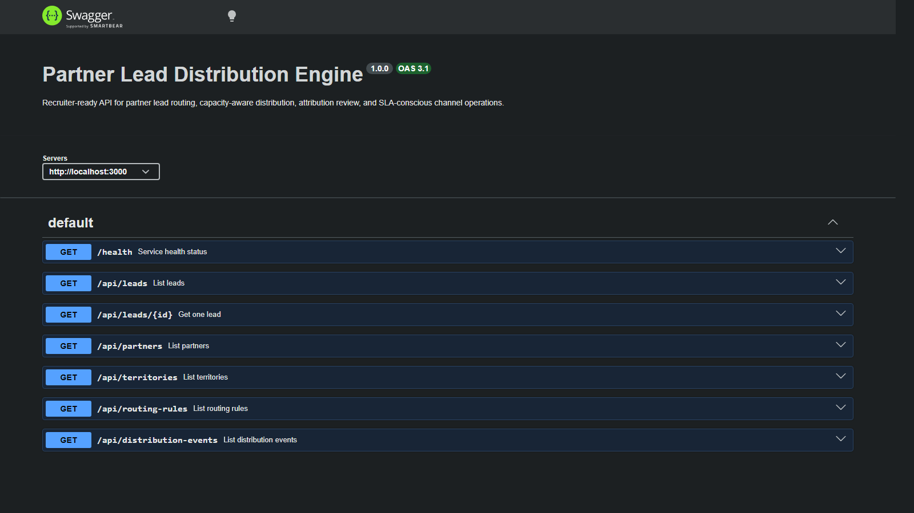
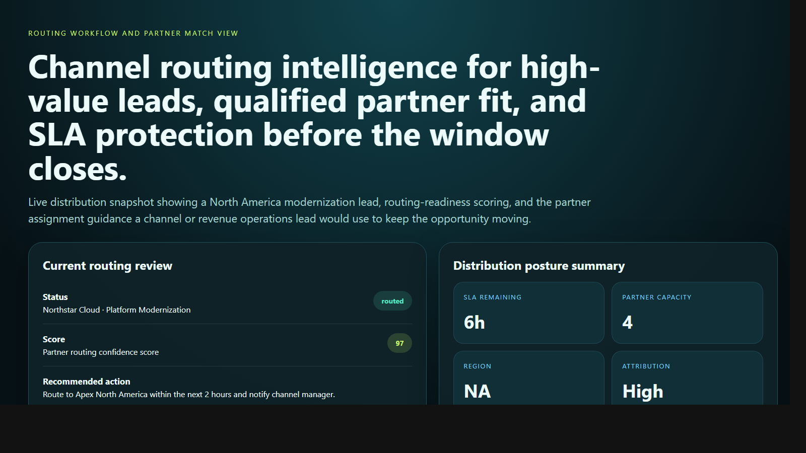
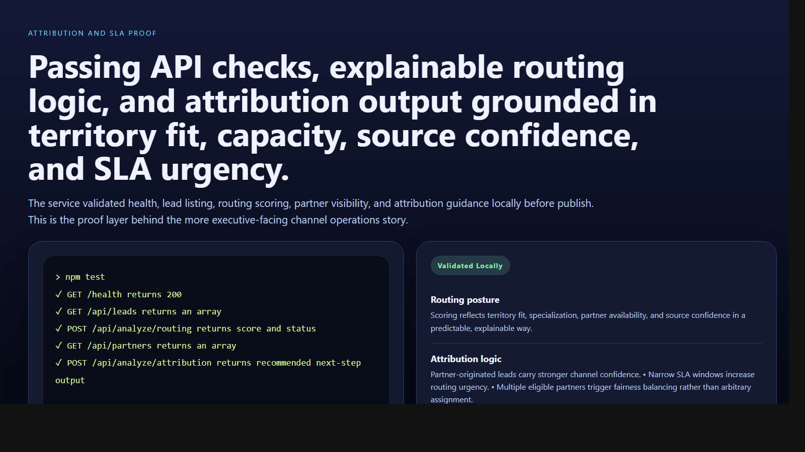

# Partner Lead Distribution Engine

> **TypeScript portfolio project** demonstrating partner lead routing, SLA-aware distribution, attribution confidence, and territory-governed channel operations for enterprise revenue systems.

**Recruiter takeaway:** *"This person understands channel operations and partner lead flow as operational decision systems, not just assignment tables."*

---

## Project Overview

| Attribute | Detail |
|---|---|
| **Runtime** | Node.js + TypeScript |
| **Framework** | Express 5 |
| **Domain** | Partner operations, channel routing, attribution governance |
| **Signal Areas** | Territory fit · Specialization match · Partner capacity · SLA posture · Attribution confidence |
| **Operational Outputs** | Routing posture · Capacity analysis · Attribution guidance |
| **Docs** | Swagger UI at `/docs` |

---

## Executive Summary

Partner Lead Distribution Engine models the kind of internal system partnerships, channel teams, sales operations, and revenue operations use to route inbound opportunities to the right partners without breaking SLA expectations or channel rules. Instead of assigning leads mechanically, the API evaluates geography, industry fit, product-line specialization, available capacity, and attribution context to determine whether a lead should be routed, manually reviewed, or escalated.

The result is a recruiter-facing backend project that feels like a realistic revenue operations engine rather than a generic lead router.

---

## Business Problem

Partner distribution breaks down when lead routing is handled with incomplete territory rules, weak specialization matching, poor partner-capacity visibility, or no shared view of attribution confidence. High-value opportunities can miss SLA windows, over-favor one partner unfairly, or be routed to the wrong channel entirely.

---

## Solution

This API turns partner lead routing into decision support. It models leads, partners, territories, routing rules, distribution events, and attribution records, then returns:

- routing-readiness scores
- capacity-aware distribution guidance
- attribution-aware routing confidence
- dashboard-level channel operations summaries

---

## Architecture

```text
Lead scenario or routing request
    |
    v
POST /api/analyze/*
    |
    +--> Request validation
    +--> Territory and specialization review
    +--> Capacity and SLA posture analysis
    +--> Attribution confidence and fairness routing
    |
    v
Routing posture
    |
    +--> routed
    +--> needs-review
    +--> unassigned
```

### Routing Workflow

1. Teams submit a routing scenario or query current lead, partner, and rule data.
2. The service validates request shape with Zod.
3. Routing logic reviews region alignment, industry and product-line fit, partner capacity, remaining SLA, and attribution context.
4. The service returns a score, issues, passed checks, and a recommended next action.
5. Operators use dashboard, routing-rule, and distribution-event views to protect SLA performance and fair partner coverage.

---

## API Endpoints

| Method | Endpoint | Purpose |
|---|---|---|
| `GET` | `/health` | Service status and uptime |
| `GET` | `/api/leads` | List leads |
| `GET` | `/api/leads/:id` | Fetch one lead |
| `GET` | `/api/partners` | List partners |
| `GET` | `/api/territories` | List territories |
| `GET` | `/api/routing-rules` | List routing rules |
| `GET` | `/api/distribution-events` | List distribution events |
| `GET` | `/api/dashboard/summary` | Channel operations summary |
| `POST` | `/api/analyze/routing` | Analyze partner routing |
| `POST` | `/api/analyze/capacity` | Analyze partner capacity posture |
| `POST` | `/api/analyze/attribution` | Analyze attribution and routing confidence |

---

## Sample Routing Request

```json
{
  "companyName": "Northstar Cloud",
  "region": "North America",
  "industry": "Cloud Infrastructure",
  "companySize": 1200,
  "leadSource": "partner-webinar",
  "productLine": "Platform Modernization",
  "slaHoursRemaining": 6
}
```

## Sample Routing Response

```json
{
  "status": "routed",
  "score": 97,
  "issues": [
    "SLA window is narrowing and requires rapid assignment."
  ],
  "passedChecks": [
    "Territory alignment is valid.",
    "Partner capacity is currently available.",
    "Partner specialization matches the product line.",
    "Enterprise account size supports routing to higher-tier partner coverage.",
    "Lead source carries strong attribution confidence for partner distribution."
  ],
  "recommendedNextAction": "Route to Apex North America within the next 2 hours and notify channel manager."
}
```

---

## Screenshots

### Hero Capture



### Routing Workflow and Partner Match View



### Attribution and SLA Proof



---

## Getting Started

### Prerequisites

- Node.js 20+
- npm

### Setup

```bash
git clone https://github.com/mizcausevic-dev/partner-lead-distribution-engine.git
cd partner-lead-distribution-engine
npm install
cp .env.example .env
npm run dev
```

Visit:

- `http://localhost:3000/docs`
- `http://localhost:3000/api/leads`
- `http://localhost:3000/api/dashboard/summary`

### Run Tests

```bash
npm test
```

---

## What This Demonstrates

- channel operations translated into backend service logic
- territory and specialization-aware routing
- SLA-conscious partner distribution and escalation handling
- attribution-aware fairness thinking inside revenue systems
- production-minded TypeScript API structure with docs, tests, and operational summaries

---

## Future Enhancements

- persist routing history and partner utilization in PostgreSQL
- integrate CRM, MAP, and partner portal webhooks
- add weighted fairness policies and partner scorecards
- support channel conflict rules and direct-sales overrides
- connect routed leads to downstream pipeline and revenue outcomes

---

## Tech Stack


### Portfolio Links

- [LinkedIn](https://www.linkedin.com/in/mirzacausevic)
- [Skills Page](https://mizcausevic.com/skills/)
- [Medium](https://medium.com/@mizcausevic)
- [GitHub](https://github.com/mizcausevic-dev)

---

*Part of [mizcausevic-dev's GitHub portfolio](https://github.com/mizcausevic-dev) — demonstrating partner routing systems, channel governance, and operational backend decisioning for enterprise lead distribution.*
